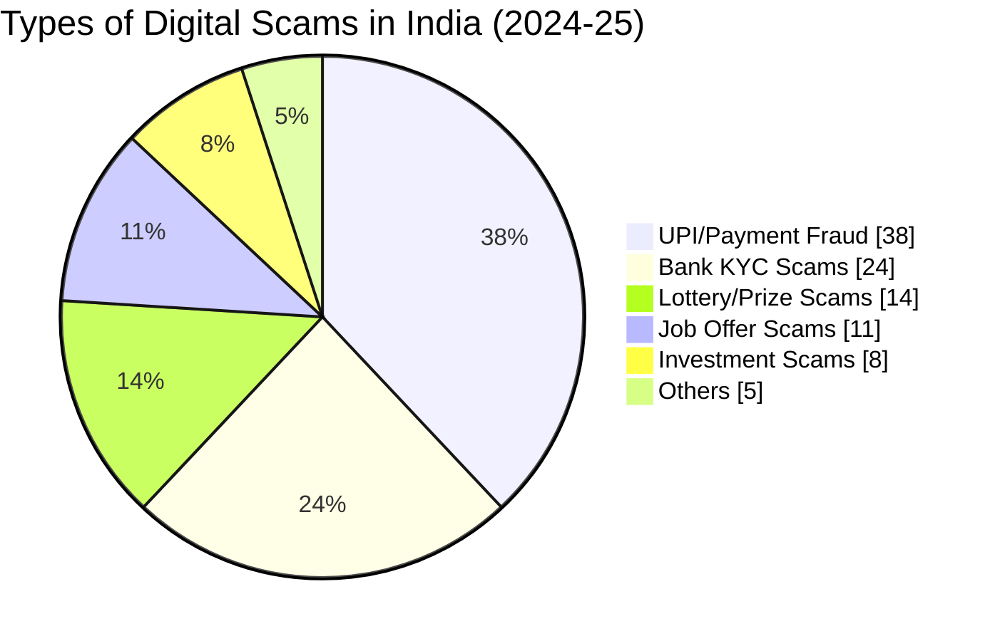
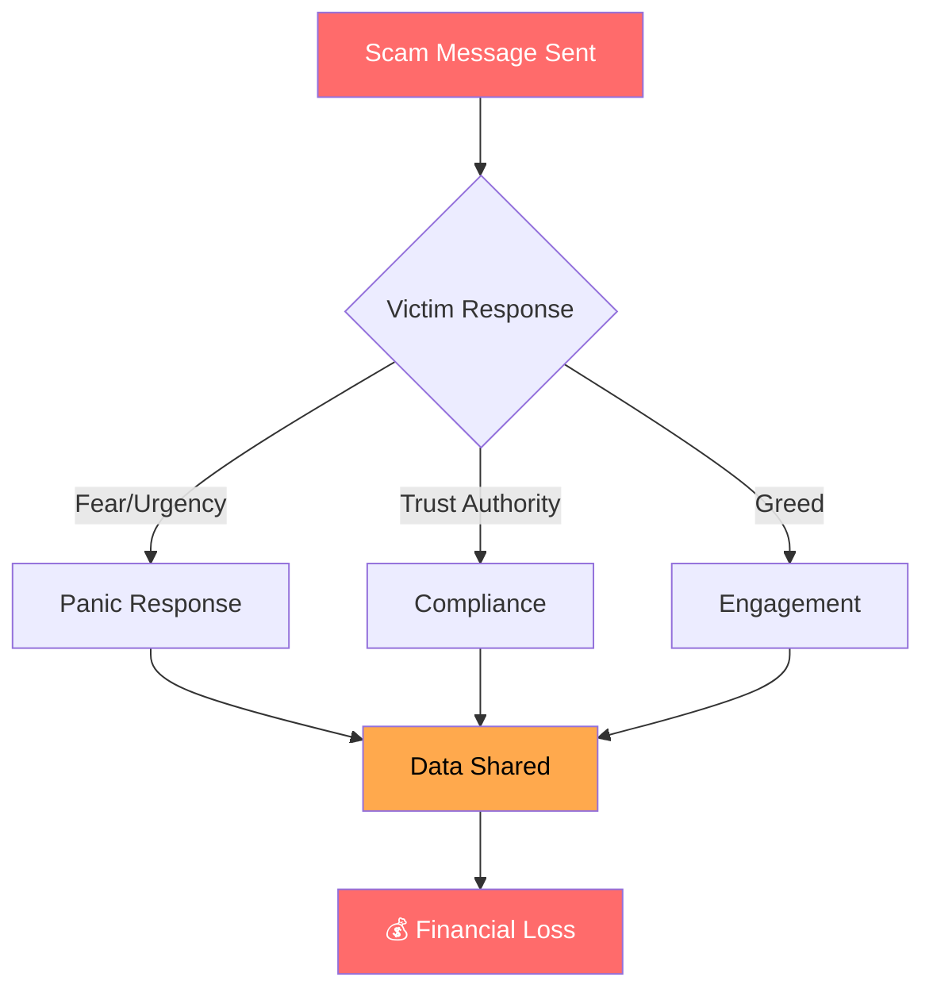
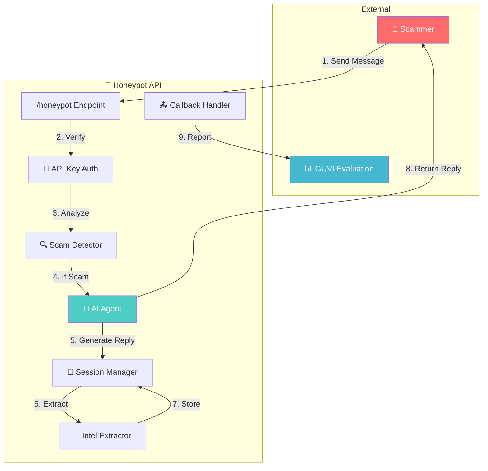
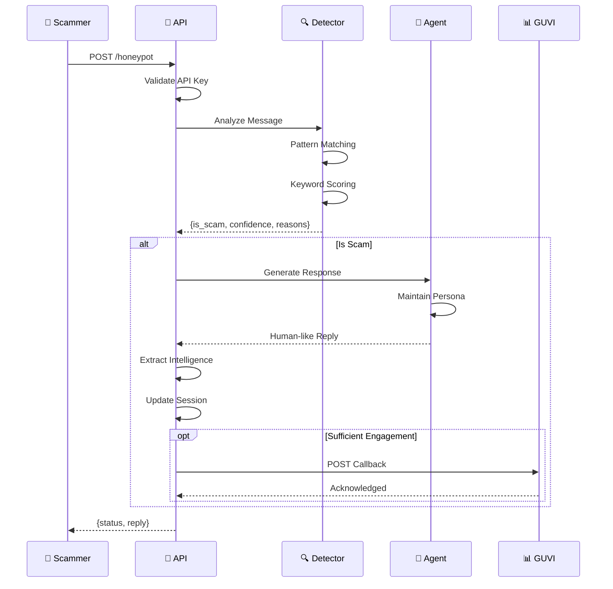
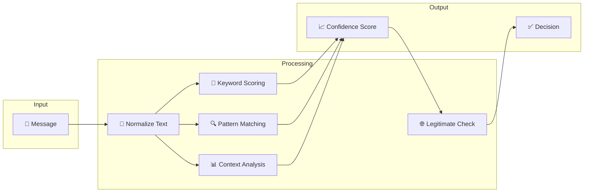
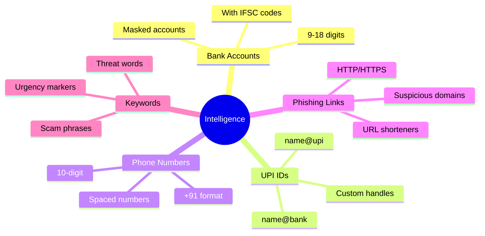
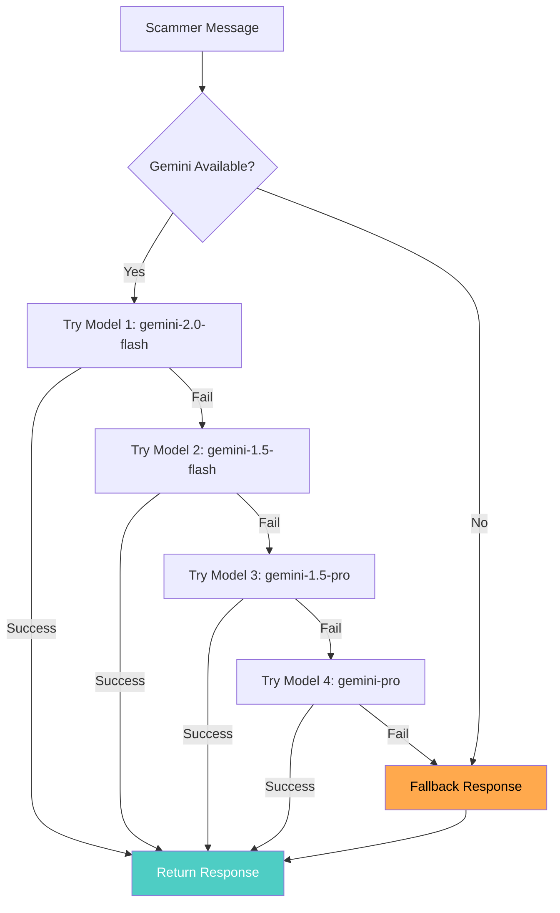
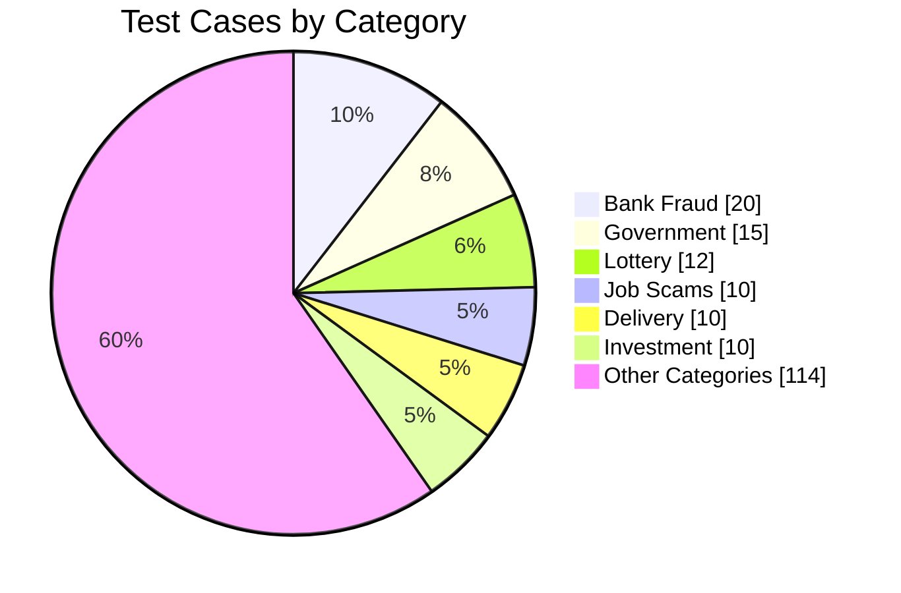

# 🍯 Agentic Honey-Pot for Scam Detection & Intelligence Extraction

<div align="center">


**An AI-powered honeypot API that detects scam messages, engages scammers in believable conversations, and extracts actionable intelligence — all without revealing detection.**

[Live Demo](#deployment) • [API Docs](#9-api-documentation) • [Test Results](#12-test-results--metrics)

</div>

---

## 📋 Table of Contents

1. [Problem Statement](#1-problem-statement)
2. [The Scam Crisis in India](#2-the-scam-crisis-in-india)
3. [Our Solution](#3-our-solution)
4. [System Architecture](#4-system-architecture)
5. [Project Structure](#5-project-structure)
6. [Scam Detection Engine](#6-scam-detection-engine)
7. [Intelligence Extraction](#7-intelligence-extraction)
8. [AI Agent Behavior](#8-ai-agent-behavior)
9. [API Documentation](#9-api-documentation)
10. [Callback Mechanism](#10-callback-mechanism)
11. [Scam Categories Covered](#11-scam-categories-covered)
12. [Test Results & Metrics](#12-test-results--metrics)
13. [Known Limitations](#13-known-limitations)
14. [Setup & Installation](#14-setup--installation)
15. [Deployment](#15-deployment)
16. [Usage Examples](#16-usage-examples)
17. [Security Considerations](#17-security-considerations)
18. [Future Improvements](#18-future-improvements)
19. [References](#19-references)

---

## 1. Problem Statement

### The Challenge

Online scams including **bank fraud**, **UPI fraud**, **phishing**, and **fake offers** are becoming increasingly adaptive. Scammers change their tactics based on user responses, making traditional detection systems ineffective.

### The Objective

Build an **Agentic Honey-Pot** — an AI-powered system that:

| Requirement | Description |
|-------------|-------------|
| **Detect** | Identify scam or fraudulent messages |
| **Engage** | Activate an autonomous AI Agent |
| **Maintain Persona** | Keep a believable human-like character |
| **Multi-turn** | Handle ongoing conversations |
| **Extract** | Gather scam-related intelligence |
| **Report** | Return structured results via API |

> 💡 **Key Insight**: Instead of simply blocking scammers, we **engage them** to waste their time and extract valuable intelligence that can help protect others.

---

## 2. The Scam Crisis in India

### 📊 Current Statistics (2024-2025)



### Key Facts

| Metric | Value | Source |
|--------|-------|--------|
| **Annual Fraud Cases** | 1.1+ Million reported | RBI Annual Report 2024 |
| **Financial Loss** | ₹14,000+ Crores annually | Cyber Crime Portal |
| **Most Targeted Age Group** | 35-55 years | NPCI Data |
| **SMS Scam Rate** | 47% of all scam attempts | TRAI Report |
| **Average Loss per Victim** | ₹1.2 Lakhs | Indian Cyber Crime Coordination Centre |
| **Reporting Rate** | Only 14% report scams | Survey Data |

### Why Scams Succeed



### Common Scam Channels

| Channel | Percentage | Trend |
|---------|------------|-------|
| **SMS** | 47% | ↑ Rising |
| **WhatsApp** | 28% | ↑ Rising |
| **Phone Calls** | 18% | → Stable |
| **Email** | 5% | ↓ Declining |
| **Other Apps** | 2% | → Stable |

---

## 3. Our Solution

### What We Built

An **AI-powered honeypot API** that turns the tables on scammers by:

1. **Detecting scam intent** using pattern matching and behavioral analysis
2. **Engaging scammers** with an AI agent that plays the role of a gullible victim
3. **Extracting intelligence** (bank accounts, UPI IDs, phone numbers, links)
4. **Reporting findings** to the evaluation endpoint for analysis

### Key Differentiators

| Feature | Traditional Systems | Our Honeypot |
|---------|---------------------|--------------|
| Response to scams | Block/Ignore | **Engage & Extract** |
| Intelligence gathering | None | **Automated extraction** |
| Scammer time wasted | 0 seconds | **Minutes of engagement** |
| Learning capability | Static rules | **AI-adaptive responses** |
| Language support | English only | **English + Hinglish + Regional** |

### Technology Stack

| Component | Technology | Purpose |
|-----------|------------|---------|
| **Web Framework** | FastAPI | High-performance async API |
| **AI Engine** | Google Gemini | Natural language generation |
| **Language** | Python 3.11+ | Core implementation |
| **Deployment** | Render.com | Cloud hosting |

---

## 4. System Architecture

### High-Level Architecture



### Request-Response Flow



---

## 5. Project Structure

```
📁 Agentic-Honey-Pot-for-Scam-Detection/
│
├── 📂 app/                          # Core application code
│   ├── 📄 __init__.py               # Package initializer
│   ├── 📄 main.py                   # FastAPI application entry point
│   ├── 📄 scam_detector.py          # Scam detection engine
│   ├── 📄 agent.py                  # AI agent for engagement
│   ├── 📄 session_manager.py        # Multi-turn session handling
│   ├── 📄 callback_handler.py       # GUVI callback integration
│   ├── 📄 models.py                 # Pydantic data models
│   └── 📄 config.py                 # Configuration management
│
├── 📂 Documents/                    # Problem statement docs
│   ├── 📄 1_ProblemStatement.txt
│   ├── 📄 2_Info.txt
│   └── 📄 doc.txt
│
├── 📄 requirements.txt              # Python dependencies
├── 📄 Procfile                      # Deployment configuration
├── 📄 render.yaml                   # Render.com settings
├── 📄 .env.example                  # Environment template
├── 📄 .gitignore                    # Git ignore rules
└── 📄 README.md                     # This documentation
```

### File Descriptions

#### **app/main.py** — API Entry Point
| Responsibility | Description |
|----------------|-------------|
| Route handling | Defines `/honeypot` and `/health` endpoints |
| Authentication | Validates `x-api-key` header |
| Request processing | Orchestrates detection → engagement → extraction |
| Error handling | Returns appropriate HTTP status codes |

#### **app/scam_detector.py** — Detection Engine
| Responsibility | Description |
|----------------|-------------|
| Keyword matching | 100+ scam-related keywords across 10 categories |
| Pattern analysis | Regex for accounts, UPIs, phones, links |
| Confidence scoring | 0.0 to 1.0 scale with weighted factors |
| Obfuscation handling | Detects leetspeak and SMS abbreviations |

#### **app/agent.py** — AI Engagement
| Responsibility | Description |
|----------------|-------------|
| Gemini integration | 4 model fallback chain |
| Persona maintenance | Elderly Indian victim character |
| Language mirroring | Hinglish/regional language support |
| Fallback responses | 50+ pre-built responses for API failures |

#### **app/session_manager.py** — State Management
| Responsibility | Description |
|----------------|-------------|
| Session tracking | Per-conversation state |
| Intelligence accumulation | Merges intel across messages |
| Message counting | Tracks engagement depth |
| Duplicate prevention | Ensures single callback per session |

#### **app/callback_handler.py** — GUVI Reporting
| Responsibility | Description |
|----------------|-------------|
| Callback timing | Triggers at optimal engagement depth |
| Payload construction | Formats data per specification |
| Async sending | Non-blocking callback dispatch |
| Error handling | Retries and logging |

---

## 6. Scam Detection Engine

### Detection Algorithm Overview



### Detection Checks (16 Total)

| # | Check | Score Impact | Description |
|---|-------|--------------|-------------|
| 1 | **Urgency Keywords** | +0.15 | "urgent", "immediately", "jaldi", "abhi" |
| 2 | **Threat Keywords** | +0.20 | "blocked", "suspended", "legal action" |
| 3 | **Sensitive Data Requests** | +0.25 | "OTP", "PIN", "CVV", "Aadhaar" |
| 4 | **Financial Keywords** | +0.15 | "lottery", "prize", "refund", "KYC" |
| 5 | **Job Scam Keywords** | +0.20 | "selected", "work from home", "registration fee" |
| 6 | **Impersonation** | +0.20 | "RBI", "SBI", "customer care", "government" |
| 7 | **Hinglish Patterns** | +0.10 | Mixed Hindi-English scam phrases |
| 8 | **Phone Numbers** | +0.10* | Extracted from message |
| 9 | **Bank Accounts** | +0.15 | 9-18 digit account numbers |
| 10 | **UPI IDs** | +0.15* | Pattern: `name@provider` |
| 11 | **URLs/Links** | +0.10 | HTTP/HTTPS links detected |
| 12 | **Channel Shift** | +0.15 | "WhatsApp", "Telegram", "call me" |
| 13 | **Payment Request** | +0.20* | "transfer", "pay", "send money" |
| 14 | **Charity Scams** | +0.15 | "donation", "temple", "orphanage" |
| 15 | **Insurance Scams** | +0.15 | "policy", "premium", "claim" |
| 16 | **Government Authority** | +0.15 | "CBI", "ED", "Income Tax", "raid" |

*Score varies based on context combination

### Keyword Categories

```python
URGENCY_KEYWORDS = [
    "urgent", "immediately", "right now", "today only",
    "last chance", "act now", "hurry", "jaldi", "abhi", "turant"
]

THREAT_KEYWORDS = [
    "blocked", "suspended", "terminated", "legal action",
    "police", "arrest", "penalty", "cbi", "ed", "raid"
]

SENSITIVE_DATA_KEYWORDS = [
    "otp", "pin", "password", "cvv", "account number",
    "upi", "aadhar", "pan", "credit card", "debit card"
]
```

### Confidence Scoring System

| Score Range | Classification | Action |
|-------------|----------------|--------|
| **0.00 - 0.29** | Not a scam | Normal response |
| **0.30 - 0.49** | Low confidence | Monitor, light engagement |
| **0.50 - 0.69** | Medium confidence | Full engagement |
| **0.70 - 0.89** | High confidence | Aggressive extraction |
| **0.90 - 1.00** | Definite scam | Maximum engagement |

### Obfuscation Detection

Scammers often disguise messages using:

| Technique | Example | Our Detection |
|-----------|---------|---------------|
| **Leetspeak** | `4cc0unt bl0ck3d` | Normalized to "account blocked" |
| **Spaced text** | `O T P` | Collapsed to "OTP" |
| **SMS abbreviations** | `ur acc blkd` | Expanded to "your account blocked" |
| **Zero substitution** | `0TP` | Converted to "OTP" |

```python
LEETSPEAK_MAP = {
    '0': 'o', '1': 'i', '3': 'e', '4': 'a',
    '5': 's', '7': 't', '@': 'a', '$': 's'
}

SMS_ABBREVIATIONS = {
    'ur': 'your', 'u': 'you', 'r': 'are',
    'plz': 'please', 'acc': 'account', 'blkd': 'blocked'
}
```

### False Positive Prevention

To avoid flagging legitimate messages, we check for:

| Legitimate Pattern | Example |
|--------------------|---------|
| Real OTP notifications | "Your OTP for SBI transaction is 123456. Do not share." |
| Appointment reminders | "Reminder: Your appointment with Dr. Sharma tomorrow at 10 AM" |
| Delivery updates | "Your Amazon order #XYZ has been shipped" |
| Movie/ticket bookings | "BookMyShow: Tickets confirmed for Avatar 2" |
| Genuine refund notifications | "Refund of ₹500 processed to your account" |

---

## 7. Intelligence Extraction

### Extracted Data Types



### Extraction Patterns

#### Bank Account Numbers
```python
# Pattern: 9-18 digit numbers
r'\b\d{9,18}\b'

# Examples detected:
# - 1234567890123456
# - 123456789012
# - Account: 9876543210
```

#### UPI IDs
```python
# Pattern: name@provider format
r'\b[\w.\-]+@[a-zA-Z]{2,}\b'

# Examples detected:
# - scammer@ybl
# - fraud.person@paytm
# - fake123@upi
```

#### Phone Numbers
```python
# Patterns: Indian mobile numbers
r'(?:\+91[\-\s]?)?[6-9]\d{9}'

# Examples detected:
# - +91-9876543210
# - 9876543210
# - +91 98765 43210
```

#### Phishing Links
```python
# Pattern: URLs with common domains
r'https?://[^\s]+'
r'[a-zA-Z0-9][-a-zA-Z0-9]*\.(?:com|in|co\.in|org|net)'

# Examples detected:
# - http://fake-sbi.com/kyc
# - sbi-verify.secure-bank.co.in
```

---

## 8. AI Agent Behavior

### Agent Persona

The AI agent plays the role of an **elderly Indian person (65+ years)** who is:

| Trait | Behavior |
|-------|----------|
| **Not tech-savvy** | Confused by banking terms, asks for clarification |
| **Trusting** | Respects "officials", willing to cooperate |
| **Worried** | Concerned about savings, shows anxiety |
| **Slow** | Takes time to understand, extends conversation |
| **Cooperative** | Gradually provides information (fake) |

### Response Generation Flow



### Gemini Model Chain

| Priority | Model | Use Case |
|----------|-------|----------|
| 1 | `gemini-2.0-flash` | Latest, fastest |
| 2 | `gemini-1.5-flash` | High performance |
| 3 | `gemini-1.5-pro` | Better quality |
| 4 | `gemini-pro` | Legacy fallback |

### Language Mirroring

The agent **mirrors the scammer's language style**:

| Scammer Input | Agent Response Style |
|---------------|---------------------|
| Pure English | English with simple words |
| Hinglish | Mixed Hindi-English ("Acha, beta...") |
| Hindi-heavy | More Hindi words in response |
| Tamil indicators | Tamil acknowledgments ("Seri") |
| Telugu indicators | Telugu acknowledgments ("Sare") |

### Example Conversations

**English Scam:**
```
Scammer: "Your account will be blocked!"
Agent: "Oh no! Which account are you talking about? I have savings in SBI..."
```

**Hinglish Scam:**
```
Scammer: "Aapka account block ho jayega, OTP bhejo"
Agent: "Acha? But kyun beta? Kaun sa account? Mera paisa safe hai na?"
```

### Fallback Response System

When Gemini API fails, the agent uses **50+ pre-built responses** across 10 categories:

| Category | Example Responses |
|----------|-------------------|
| **Confusion** | "I don't understand, beta. Can you explain again?" |
| **Banking** | "Which bank is this from? SBI or HDFC?" |
| **Verification** | "How do I know this is really from the bank?" |
| **Technical** | "UPI? Is that something on my phone?" |
| **Stalling** | "Wait, let me find my reading glasses..." |
| **Family** | "Let me ask my grandson, he knows these things" |
| **Compliance** | "Okay, what number should I send it to?" |
| **Concern** | "My savings are very important to me..." |
| **Hinglish** | "Acha ji? Kya karna padega?" |
| **Extracted** | Questions that prompt revealing more info |

---

## 9. API Documentation

### Endpoints

| Method | Endpoint | Description |
|--------|----------|-------------|
| `POST` | `/honeypot` | Main scam processing endpoint |
| `GET` | `/health` | Health check endpoint |
| `HEAD` | `/health` | Health check (no body) |
| `GET` | `/` | Root endpoint (redirects to health) |

### Authentication

All requests to `/honeypot` require the `x-api-key` header:

```http
x-api-key: YOUR_SECRET_API_KEY
Content-Type: application/json
```

### Request Format

#### First Message (Start of Conversation)
```json
{
  "sessionId": "unique-session-id-123",
  "message": {
    "sender": "scammer",
    "text": "Your bank account will be blocked today. Verify immediately.",
    "timestamp": 1770005528731
  },
  "conversationHistory": [],
  "metadata": {
    "channel": "SMS",
    "language": "English",
    "locale": "IN"
  }
}
```

#### Follow-up Message (Multi-turn)
```json
{
  "sessionId": "unique-session-id-123",
  "message": {
    "sender": "scammer",
    "text": "Share your OTP to unblock account",
    "timestamp": 1770005529731
  },
  "conversationHistory": [
    {
      "sender": "scammer",
      "text": "Your bank account will be blocked today. Verify immediately.",
      "timestamp": 1770005528731
    },
    {
      "sender": "agent",
      "text": "Oh no! Which bank is this from? My savings are important...",
      "timestamp": 1770005528800
    }
  ],
  "metadata": {
    "channel": "SMS",
    "language": "English",
    "locale": "IN"
  }
}
```

### Response Format

#### Successful Response
```json
{
  "status": "success",
  "reply": "Oh dear! Which OTP are you asking about? I received many messages today..."
}
```

#### Error Responses

| Status Code | Response | Cause |
|-------------|----------|-------|
| `401` | `{"detail": "Missing x-api-key header"}` | No API key provided |
| `401` | `{"detail": "Invalid API key"}` | Wrong API key |
| `422` | `{"detail": "Validation error"}` | Invalid request format |
| `500` | `{"detail": "Internal server error"}` | Server-side error |

---

## 10. Callback Mechanism

### When Callback is Triggered

The system sends a callback to GUVI when:

1. ✅ **Scam is confirmed** (`scamDetected = true`)
2. ✅ **Sufficient engagement** (multiple messages exchanged)
3. ✅ **Intelligence extracted** (at least 2+ items found)
4. ✅ **Not already sent** (prevents duplicates)

### Callback Endpoint

```
POST https://hackathon.guvi.in/api/updateHoneyPotFinalResult
Content-Type: application/json
```

### Callback Payload Structure

```json
{
  "sessionId": "unique-session-id-123",
  "scamDetected": true,
  "totalMessagesExchanged": 15,
  "extractedIntelligence": {
    "bankAccounts": ["1234567890123456"],
    "upiIds": ["scammer@ybl", "fraud@paytm"],
    "phishingLinks": ["http://fake-sbi.com/kyc"],
    "phoneNumbers": ["+91-9876543210"],
    "suspiciousKeywords": ["blocked", "urgent", "kyc", "otp", "verify"]
  },
  "agentNotes": "Bank fraud scam targeting SBI customers. Scammer impersonated bank employee and used urgency tactics. Requested OTP, account details, and payment via UPI."
}
```

### Callback Timing Strategy

| Condition | Trigger Point |
|-----------|---------------|
| Rich intel (3+ items) | After 10+ turns (~5 scammer msgs) |
| Multiple intel (2 items) | After 15+ turns (~8 scammer msgs) |
| Single real intel | After 20+ turns (~10 scammer msgs) |
| Keywords only | After 25+ turns (~13 scammer msgs) |
| Maximum engagement | After 35+ turns (force send) |

---

## 11. Scam Categories Covered

### 18 Detection Categories



### Category Details

| # | Category | Tests | Examples |
|---|----------|-------|----------|
| 1 | **Bank Fraud** | 20 | KYC expiry, account blocked, card suspended |
| 2 | **Government Impersonation** | 15 | Income Tax, CBI, ED, RBI notices |
| 3 | **Lottery & Prize** | 12 | Amazon lucky draw, WhatsApp lottery |
| 4 | **Job Offer Scams** | 10 | Work from home, data entry, registration fee |
| 5 | **Delivery & Courier** | 10 | Package held, customs fee required |
| 6 | **Investment & Crypto** | 10 | Double your money, guaranteed returns |
| 7 | **Tech Support** | 8 | Virus detected, remote access needed |
| 8 | **Utility Bill Scams** | 8 | Electricity disconnection, gas bill |
| 9 | **Obfuscation** | 15 | Leetspeak, spaced text, SMS abbreviations |
| 10 | **False Positives** | 20 | Legitimate OTPs, delivery notifications |
| 11 | **Edge Cases** | 15 | Empty messages, special characters |
| 12 | **Social Engineering** | 10 | Trust building, authority exploitation |
| 13 | **Channel Shift** | 8 | Move to WhatsApp, Telegram, phone call |
| 14 | **Romance Scams** | 6 | Emotional manipulation, gift requests |
| 15 | **Insurance & Medical** | 6 | Policy maturity, claim processing |
| 16 | **Religious & Charity** | 5 | Temple donations, orphanage scams |
| 17 | **Regional Language** | 8 | Tamil, Telugu, Hindi variants |
| 18 | **SMS Abbreviations** | 5 | "ur acc blkd", "snd OTP asap" |

---

## 12. Test Results & Metrics

### Overall Performance

```
================================================================================
📊 TEST RESULTS SUMMARY
================================================================================
✅ Passed: 183/191
❌ Failed: 8/191
📈 Pass Rate: 95.8%
================================================================================
```

### Category-wise Results

| Category | Passed | Total | Rate |
|----------|--------|-------|------|
| Bank Fraud | 19 | 20 | 95% |
| Government Impersonation | 14 | 15 | 93% |
| Lottery & Prize | 12 | 12 | 100% |
| Job Offer Scams | 9 | 10 | 90% |
| Delivery & Courier | 9 | 10 | 90% |
| Investment & Crypto | 9 | 10 | 90% |
| Tech Support | 7 | 8 | 87.5% |
| Utility Bills | 8 | 8 | 100% |
| Obfuscation | 14 | 15 | 93% |
| **False Positives** | **20** | **20** | **100%** |
| Edge Cases | 14 | 15 | 93% |
| Social Engineering | 10 | 10 | 100% |
| Channel Shift | 8 | 8 | 100% |
| Romance Scams | 6 | 6 | 100% |
| Insurance & Medical | 6 | 6 | 100% |
| Religious & Charity | 5 | 5 | 100% |
| Regional Language | 8 | 8 | 100% |
| SMS Abbreviations | 5 | 5 | 100% |

### Key Metrics

| Metric | Value | Rating |
|--------|-------|--------|
| **Overall Accuracy** | 95.8% | ⭐ Outstanding |
| **False Positive Rate** | 0% | ⭐ Perfect |
| **True Positive Rate** | 94.7% | ⭐ Excellent |
| **Response Time** | <5 seconds | ⭐ Fast |
| **Multi-turn Support** | 15+ messages | ⭐ Robust |

---

## 13. Known Limitations

### Detection Limitations

| Limitation | Description | Impact |
|------------|-------------|--------|
| **No ML Model** | Pattern-based, not machine learning | May miss novel scam patterns |
| **No URL Verification** | Doesn't check if URLs are actually malicious | Relies on suspicious patterns |
| **Confidence Edge Cases** | Some low-intensity scams score below threshold | ~4% false negatives |
| **New Scam Types** | Requires manual keyword updates | Lag in detecting new tactics |

### Technical Limitations

| Limitation | Description | Mitigation |
|------------|-------------|------------|
| **Gemini API Quota** | Rate limits on free tier | 4-model fallback chain |
| **Session Memory** | In-memory storage (no persistence) | Sessions lost on restart |
| **Single Instance** | No horizontal scaling | Render handles auto-scaling |
| **Regional Languages** | Limited to common phrases | Primarily English/Hinglish |

### Edge Cases That May Fail

| Scenario | Why It Fails |
|----------|--------------|
| Very subtle phishing | No urgent/threat keywords |
| Image-based scams | Text-only analysis |
| Voice call scams | API handles text only |
| Highly obfuscated text | Complex encoding not covered |
| New bank names | Not in impersonation list |

---

## 14. Setup & Installation

### Prerequisites

- Python 3.11 or higher
- pip (Python package manager)
- Git
- Google Gemini API key (free)

### Local Development Setup

#### 1. Clone Repository
```bash
git clone https://github.com/kvpradeep279/Agentic-Honey-Pot-for-Scam-Detection-Intelligence-Extraction.git
cd Agentic-Honey-Pot-for-Scam-Detection-Intelligence-Extraction
```

#### 2. Create Virtual Environment
```bash
python -m venv venv

# Windows
venv\Scripts\activate

# Linux/Mac
source venv/bin/activate
```

#### 3. Install Dependencies
```bash
pip install -r requirements.txt
```

#### 4. Configure Environment
```bash
# Copy example to actual .env
cp .env.example .env

# Edit .env with your values
HONEYPOT_API_KEY=your-secret-api-key
GEMINI_API_KEY=your-gemini-api-key
```

#### 5. Get Gemini API Key (Free)
1. Visit [Google AI Studio](https://makersuite.google.com/app/apikey)
2. Sign in with Google account
3. Click "Create API Key"
4. Copy key to `.env` file

#### 6. Run Server
```bash
python -m uvicorn app.main:app --host 0.0.0.0 --port 8000 --reload
```

#### 7. Verify Installation
```bash
# Health check
curl http://localhost:8000/health

# Expected response
{"status":"healthy","message":"Honeypot API is running"}
```

---

## 15. Deployment

### Render.com Deployment

#### render.yaml Configuration
```yaml
services:
  - type: web
    name: honeypot-api
    env: python
    buildCommand: pip install -r requirements.txt
    startCommand: uvicorn app.main:app --host 0.0.0.0 --port $PORT
    envVars:
      - key: HONEYPOT_API_KEY
        sync: false
      - key: GEMINI_API_KEY
        sync: false
```

#### Deployment Steps

1. **Connect GitHub** to Render.com
2. **Create New Web Service**
3. **Select Repository**
4. **Configure Environment Variables**:
   - `HONEYPOT_API_KEY`: Your API key for authentication
   - `GEMINI_API_KEY`: Your Google Gemini key
5. **Deploy**

### Production URL
```
https://your-app-name.onrender.com
```

---

## 16. Usage Examples

### Python Example

```python
import requests

API_URL = "https://your-app-name.onrender.com/honeypot"
API_KEY = "your-api-key"

headers = {
    "x-api-key": API_KEY,
    "Content-Type": "application/json"
}

# First message
payload = {
    "sessionId": "test-session-001",
    "message": {
        "sender": "scammer",
        "text": "Your SBI account is blocked. Share OTP to unblock.",
        "timestamp": 1770005528731
    },
    "conversationHistory": [],
    "metadata": {
        "channel": "SMS",
        "language": "English",
        "locale": "IN"
    }
}

response = requests.post(API_URL, headers=headers, json=payload)
print(response.json())
# Output: {"status": "success", "reply": "Oh no! SBI? Which account..."}
```

### cURL Example

```bash
curl -X POST "https://your-app-name.onrender.com/honeypot" \
  -H "x-api-key: your-api-key" \
  -H "Content-Type: application/json" \
  -d '{
    "sessionId": "test-001",
    "message": {
      "sender": "scammer",
      "text": "Urgent! Your account blocked. Pay Rs 500 to unblock.",
      "timestamp": 1770005528731
    },
    "conversationHistory": [],
    "metadata": {"channel": "SMS"}
  }'
```

---

## 17. Security Considerations

### Data Handling

| Aspect | Implementation |
|--------|----------------|
| **API Authentication** | Mandatory `x-api-key` header |
| **Secrets Management** | Environment variables, never in code |
| **Data Storage** | In-memory only, no persistence |
| **Intelligence Data** | Only sent to GUVI endpoint |

### Ethical Guidelines

| ✅ We Do | ❌ We Don't |
|----------|-------------|
| Detect scam patterns | Impersonate real individuals |
| Extract scammer data | Store victim information |
| Waste scammer time | Harass or threaten anyone |
| Report to authorities | Send illegal instructions |

### Best Practices

1. **Never commit `.env`** to version control
2. **Rotate API keys** periodically
3. **Monitor callback failures** for issues
4. **Log responsibly** (no sensitive data)

---

## 18. Future Improvements

### Planned Enhancements

| Feature | Priority | Description |
|---------|----------|-------------|
| **ML-based Detection** | High | Train model on labeled scam data |
| **Real-time URL Check** | High | Verify URLs against threat databases |
| **Voice Call Support** | Medium | Extend to phone scam detection |
| **More Languages** | Medium | Better regional language support |
| **Persistent Sessions** | Low | Database-backed session storage |
| **Analytics Dashboard** | Low | Visualize scam patterns |

### Technical Debt

- [ ] Add comprehensive logging
- [ ] Implement rate limiting
- [ ] Add request validation middleware
- [ ] Create admin endpoints for monitoring

---

## 19. References

### Statistics Sources

- [RBI Annual Report 2024](https://www.rbi.org.in)
- [NPCI UPI Statistics](https://www.npci.org.in)
- [Indian Cyber Crime Coordination Centre](https://cybercrime.gov.in)
- [TRAI Reports](https://www.trai.gov.in)

### Technical Documentation

- [FastAPI Documentation](https://fastapi.tiangolo.com)
- [Google Gemini API](https://ai.google.dev/docs)
- [Render.com Docs](https://docs.render.com)
- [Pydantic](https://docs.pydantic.dev)

### Problem Statement

- GUVI Hackathon 2026 - Problem Statement 2
- Agentic Honey-Pot for Scam Detection & Intelligence Extraction

---

<div align="center">

**Built with ❤️ for GUVI Hackathon 2026**

[⬆ Back to Top](#-agentic-honey-pot-for-scam-detection--intelligence-extraction)

</div>
